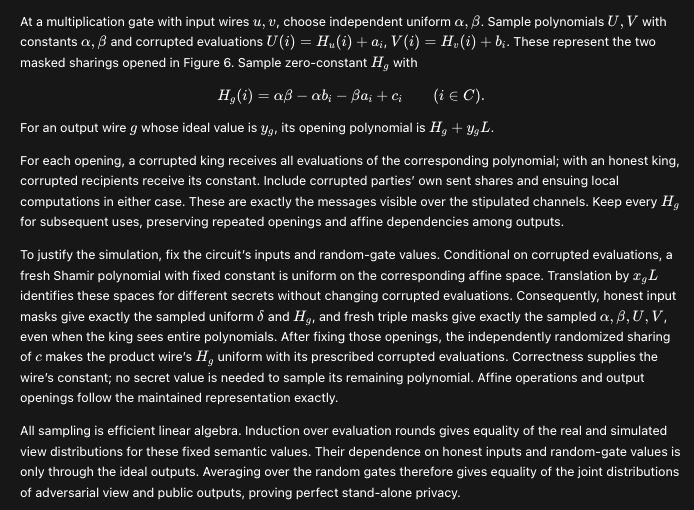
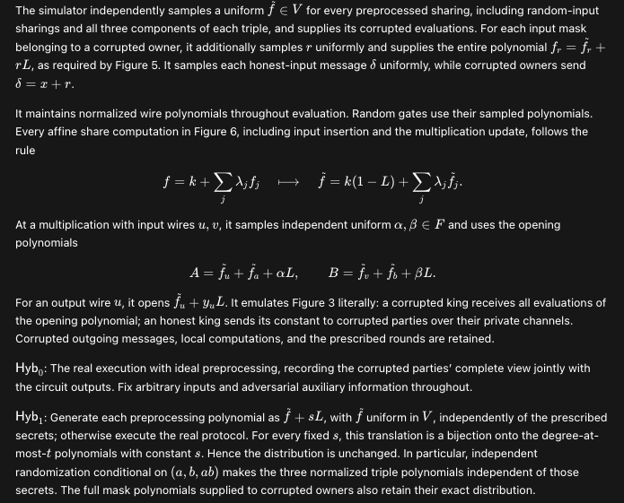

# Cryptography Research Skills

## Introduction

I plan for this to be a public repository that helps people do AI-assisted research in cryptography and helps people draft cryptography papers that are readable by people who work in this field. The skills are developed during my research
in cryptography, especially in secure multiparty computation (MPC) and zero-knowledge proofs. The current version may not help too much in lattice-based (or post-quantum) cryptography, but lattice-based cryptography is definitely on my roadmap.

When we ask AI to write a proof for a theorem in cryptography, the proof may look mathematically plausible while containing gaps or using unfamiliar terminology and styles. For example, a familiar way to present a simulation-based security proof for a maliciously secure MPC protocol is to first describe the simulator, then write a sequence of hybrid arguments that starts with the real world and ends with the ideal world. The set of skills in this repo encourages this organization where it clarifies the argument; a direct distributional proof can also be appropriate. During the development of the skills, I feed in classic textbooks and papers and ask AI to summarize the styles and terminology. Note that as a cryptography researcher or a PhD student, you should still think about how the simulator works and how the hybrids would go. The real learning happens when you realize the subtleties in the proofs. The purpose of the writing skills in this repo is to help you understand AI-generated cryptography proofs better, in a common language that cryptographers speak.

I describe the three stages of cryptography paper writing:

1. The first stage is pure AI slop. It may be correct, but the content is unreadable.
2. The second stage is an AI-generated write-up, with the help of the skills in this repo. It presents itself in a more friendly and familiar way to people who do research in cryptography. By doing this, it helps cryptography researchers understand AI-generated proofs better and also makes it easier for AI to expose its mistakes.
3. The final stage is a human-authored paper, where the human author extracts the insights from the write-up in the previous stage and expresses them in his own words.

Our skills in this repo are building this bridge between AI slop and human insights. I believe it is always best for humans to write our own protocol constructions, theorem statements, and proofs, although AI can be (and should probably be) an independent auditor to check the correctness of our proofs. Human writing is precious. It expresses humans' thoughts and spirits and connects human society. Nowadays, if I find anything that feels like AI slop, I immediately stop reading, because I know I can ask AI to generate it on my own.

Aside from paper writing, the repo also contains skills that guide the implementation of cryptographic protocols. Now that code is becoming cheap, a lot more theoretical papers can have actual implementations. Research would be much more useful and well-founded if people could see the protocols running in the real world.

I agree that AI is really good at math and that in turn also advances research in cryptography. However, I believe the most fascinating aspect of cryptography is the invention of new notions such as zero-knowledge proofs. AI is pretty
good at following prior work and pushing the boundaries, but defining new things would require human imagination and creativity that I believe current AI may not be so good at.

If you have any suggestions on this repo, feel free to reach out to me at ziyang@cs.toronto.edu.

Have fun,

Ziyang Jin

## Installation

The skills work with **Codex and Claude Code**. Choose among three collections:

- **Research:** four skills to formulate thoughts clearly: turn an idea into a precise question, separate assumptions from claims, check reasoning and literature, and define the interfaces and costs that matter.
- **Writing:** five skills to express established ideas and evidence in manuscript prose, prior-work comparisons, evaluation sections, and publication materials.
- **Implementation:** three skills for protocol code, reproducible benchmarks, and research artifacts.

You need Python 3 and your chosen agent installed. Clone this repository to a stable location; the installer creates directory symlinks to its skill folders.

The [skill catalog](docs/skills.md) lists the skills in each collection. Start with the skill matching your requested result; specialist references and companion skills are loaded only when needed. The collections can be used independently and do not prescribe a sequence.

```sh
git clone https://github.com/ziyang-theory/cryptography-research-skills.git
cd cryptography-research-skills
```

### Codex

Install Research:

```sh
python3 scripts/install.py --agent codex --collection research
```

### Claude Code

Install Research:

```sh
python3 scripts/install.py --agent claude --collection research
```

Run both commands to use the same skills in both tools. Replace `research` with `writing` or `implementation` to install that collection, or with `all` to install all twelve skills. Omitting `--agent` defaults to Codex; omitting `--collection` defaults to Research.

Start a fresh agent session after installation. In Codex, mention `$crypto-proof-auditor`; in Claude Code, try:

```text
/crypto-proof-auditor Audit the security proof in this manuscript.
```

The installer preserves existing files and matching links, and migrates recognized links to this checkout's former collection paths. Keep the checkout in place while the skills are installed. See the [installation details](docs/installation.md) for migration, personal directories, individual skills, custom destinations, previews, updates, and conflict handling.

## Showcase: a short MPC security proof

We asked two isolated Codex sessions, using the same model and prompt, to write a short privacy proof for the semi-honest protocol in Section 3.4 of DN07 (Damgård–Nielsen, 2007). Both assumed protocol correctness and ideal preprocessing. One session had no skills; the other used this collection.

The excerpts below show how the skills affect proof presentation: the response with skills describes the simulator and then gives named hybrid arguments, making the real-to-ideal transitions explicit.

### Without skills

The response justifies the simulation through a direct distributional argument.



### With skills

The response follows the simulator description with labeled hybrids and explanations of the transitions.



## Further reading

- [Skill catalog](docs/skills.md): all twelve skills and guidance on choosing one.
- [Installation details](docs/installation.md): how Codex and Claude Code share the skills and additional installation options.
- [Maintenance](docs/maintenance.md): repository layout, validation, and guidance for changes.
- [OpenAI plugin submission](submission/README.md): build the skills-only plugin package and reproduce its review cases.

## License and citation

The repository's original skill instructions, documentation, configuration, and code are available under the [MIT License](LICENSE). Third-party material remains subject to its own terms.

If you find these skills useful in your research, please consider citing this repository using the metadata in [CITATION.cff](CITATION.cff). Academic citation is appreciated but not required; the MIT license and copyright notice requirements still apply when copying or redistributing the material.
